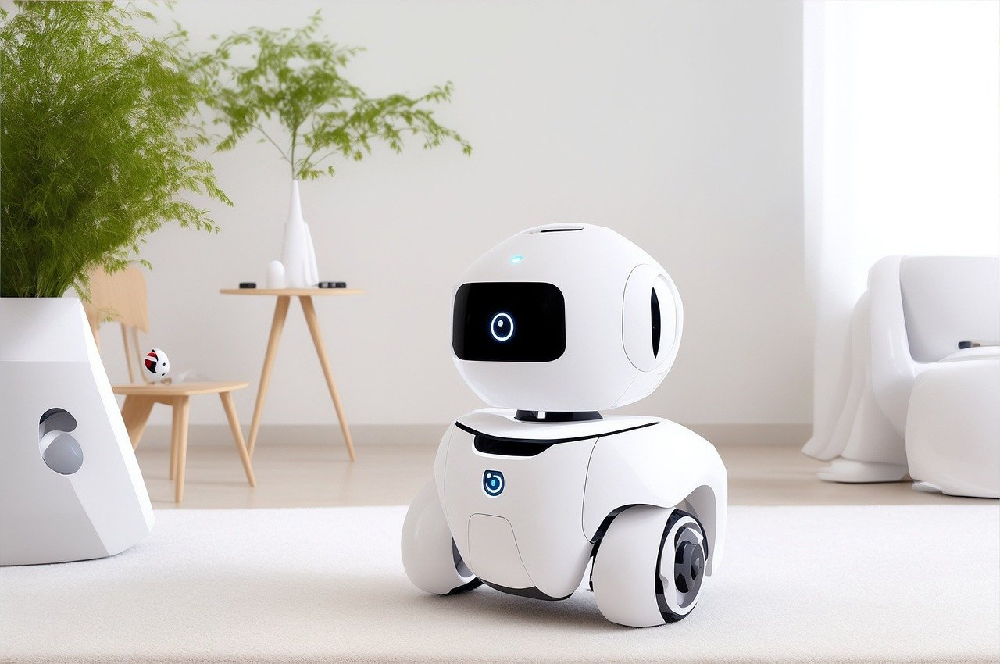

# F1 Explora el Mundo Asombroso de la Inteligencia Artificial con Nosotros! 🌟

¡Hola, exploradores científicos! ¿Alguna vez os habéis preguntado cómo sería tener un robot como amigo o cómo los computadores pueden aprender cosas nuevas como nosotros? ¡Estáis en el lugar correcto para descubrir los secretos de la Inteligencia Artificial (IA)! Preparad vuestras mentes curiosas, porque hoy vamos a sumergirnos en un viaje increíble por el mundo de la IA.

## F2: ¿Qué es la Inteligencia Artificial?
La Inteligencia Artificial, o IA, es como un cerebro mágico en las computadoras y robots que les ayuda a pensar y aprender. Imagina que tienes un amigo robot que puede recordar tu helado favorito o sugerirte juegos que te podrían gustar. ¡Eso es IA en acción!

**Llamada a la acción:** ¡Dibuja un robot y piensa en tres cosas increíbles que te gustaría que hiciera!

## F3: Los Grandes Jugadores de la IA
Muchas empresas inteligentes están trabajando para hacer la IA aún más sorprendente. Vamos a ver qué están haciendo algunas de ellas para llevar la IA al siguiente nivel.

### Tabla Comparativa: ¿Quién hace qué en el mundo de la IA?
| Empresa        | Contribuciones a la IA                                                      |
|----------------|-----------------------------------------------------------------------------|
| Amazon         | Ayuda a las tiendas a recomendarte juguetes y juegos que te encantarán.      |
| Google         | Crea formas para que encuentres respuestas rápidas a tus tareas.             |
| Elon Musk      | Imagina coches que se conducen solos sin necesidad de un conductor.          |
| Microsoft      | Desarrolla herramientas para ayudarte con los deberes y aprender cosas nuevas.|
| Meta (Facebook)| Trabaja en cómo compartir momentos divertidos con amigos en línea de manera más inteligente. |
| Apple          | Hace que sus dispositivos sean más útiles, como un iPad que puede responder tus preguntas. |
| OpenAI         | Inventan robots que pueden conversar contigo sobre tus temas favoritos.      |

**Llamada a la acción:** ¿Con cuál de estas contribuciones te gustaría ayudar o aprender más? ¡Cuéntanoslo en los comentarios!

## F4: ¿Por Qué es Importante la IA para Ti?
La IA no solo está en robots o computadoras; está en todas partes, desde tu teléfono hasta las luces de tu casa. Está cambiando el modo en que vivimos, aprendemos y jugamos. Algunos dicen que incluso podría ayudarnos a resolver problemas grandes del mundo, como cuidar el planeta.

**Llamada a la acción:** Piensa en un problema que te gustaría solucionar con la ayuda de un robot. ¿Qué haría tu robot?

¡Exploradores, eso es todo por hoy! Esperamos que este viaje al mundo de la Inteligencia Artificial os haya fascinado tanto como a nosotros. No olvidéis seguir explorando, preguntando y, sobre todo, divirtiéndoos con la ciencia. ¡Hasta la próxima aventura! 🚀

**Llamada a la acción final:** Si te ha gustado este artículo, ¡comparte con tus amigos y no te pierdas nuestros próximos artículos científicos!

### F3 ¡Sigue Investigando y Diviértete con la Ciencia!
Si quieres aprender más sobre la fascinante historia de la IA y sus protagonistas, te recomendamos que veas este vídeo increíble: La guerra por el dominio de la inteligencia artificial.

Además, puedes leer un artículo muy interesante que profundiza en este tema: La Guerra por el dominio de la inteligencia artificial: reflexiones en torno al futuro de la humanidad.

¡Exploradores, eso es todo por hoy! Esperamos que este viaje al mundo de la Inteligencia Artificial os haya fascinado tanto como a nosotros. No olvidéis seguir explorando, preguntando y, sobre todo, divirtiéndoos con la ciencia. ¡Hasta la próxima aventura! 🚀

**Llamada a la acción final:** Si te ha gustado este artículo, ¡comparte con tus amigos y no te pierdas nuestros próximos artículos científicos!
